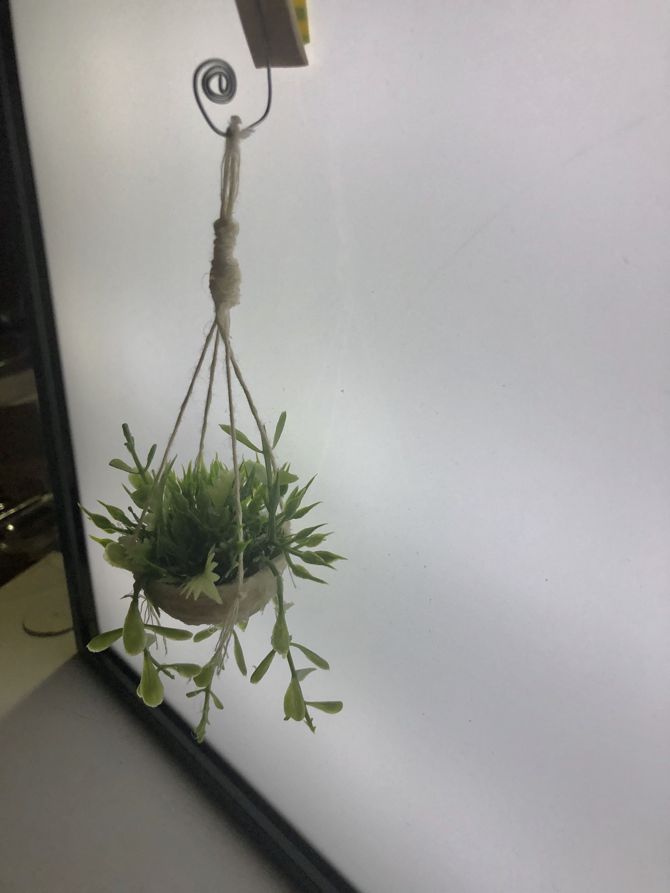

# 1701QCA Final project journal: *Hannah Healy*

<!--- As for other assessments, fill out the following journal sections with information relevant to your project. --->

<!--- Markdown reference: https://guides.github.com/features/mastering-markdown/ --->

## Related projects ##
### Related project 1 ###
*Charles Matton- 'Enclosure'*

*https://www.allvisualarts.org/artists/CharlesMatton/biography.aspx*

(This is an image of Matton's miniature scenes that look so life-like.)

Charles Matton was a painter, sculptor, designer, writer, photographer, videographer, and filmmaker. His work aimed to capture the tension in living things and animate nature by provoking and perfecting life. In his exhibition 'enclosures', Matton created small scale interiors within transparent boxes with glass fronts. Depicting theatrical, atmospheric scenes, the miniatures spaces are based on real world interiors and memories from Matton's life. Each scene is meticulously hand-built to a 1/7 scale. To create a more immersive experience and to depict not just how something looked on a particular day but how it felt, Matton introduced one-way mirrors and videos to add hypnotic optical illusions.

This exhibition is related to my project as it is created in miniature scale and visually depicts a story through the immense detail that makes the small scenes seem so life-like. It is also related to my project as it uses electronics to create a more immersive interactive experience rather than just an art piece to admire. This project has inspired me to include many minute details so I can replicate a moment in time more accurately and make the scene more life-like, thus creating a more interesting and immersive experience for the audience.

### Related project 2 ###
*The Music, Math, Art and Science Electronic Book  by Antonella Nonnis*

*http://www.antonellanonnis.com/?/work/theMMASElectronicBook/*

(Above is an image of one page of the electronic book that uses LEDs to match the colours when touched.)

The MMAS Electronic book is a book with four pages that teaches subjects such as Music, Maths, ARts and Science, through interactive moveable parts and other electronics. Nonnis created it to introduce some skills for the first year of primary school to her niece. The book uses physical moveable parts and uses the electrical capitance of the human body to trigger lights, sounds and other outputs. Powered by 2 Arduinos, the book was created using a range of recylced materials such as paper, foil, cardboard and other electric components such as wires, resistors and LEDs. 

This project is related to mine as it is also a book and uses touch sensors and the electrical capacitance of the human body. This project inspired me to delve deeper into the different ways of installing a touch sesnor into a book. This project is also similar to mine as it uses recycled materials and a system similar to the microbit. Therefore, this project has mademme realise that my project is feasible with the materials I have access to.

### Related project 3 ###
*Andy Acres*

*http://andyacres.com/*
*https://www.awesomeinventions.com/andy-acres-spooky-shadow-boxes-miniature-scenes/*

(This is an image of Acre's creepy scene that uses both mechanical construction and electronic components.)

Andy Acres is a London artist that specialises in creating highly detailed and visually dynamic models and scale miniatures. Usually creating ghostly ambiences, one of Acres' works are spooky shadow box diaromas. Within these models, Acres' uses LEDs to create creepy shadows that serve as a background to emphasise the small details. The lights can also be adjusted through an antique toggle on the side of the diaroma. By creating life-like scenes that create experiences, Acres' wants his work "to not only breathe life but to exhale".

This project is related to my project because they are both in a miniature scale and use electronics. Similar to Acres' I will also be using LEDs to create atmospheric lighting. I also want to make the scene look as realistic as possible by emphasising the small details. I wish to replicate Acres' notion of creating such a life-like scene that the scene not only breathes life but exhales.

### Related project 4 ###
*Joshua Smith*

*http://www.iknowjoshuasmith.com/
https://mymodernmet.com/joshua-smith-miniaturist-urban-scale-models/*

(This is an image of Smith's impressive miniatures that depict abandoned locations.)

Joshua Smith is a South Australian miniaturist and former stencil artist. Smith's miniature work mainly focuses on the often overlooked aspects of the urban landscape. Smith depicts things like graffiti, abandoned locations, rust and decay. In his own words Smith states, "The works I create are of buildings long forgotten and soon to be demolished. I capture their current state of a once thriving but long forgotten space.” Smith works on a 1:20 scale and uses everyday materials such as MDF, cardboard, and plastic.

This project is similar to mine as it is also created in a miniature scale. They are also related as I will be using everday materials aswell. Within my scene I also want to add a sense of a forgotten space by using retro themed furniture and creating a dated almost abandoned look. This artist has inspired me to expand the narrative further by adding more small details that develop the realness of the scene and incorporating an old vintage feel. This project is also related to mine as he uses recycled materials. Consequently, this has shown me the amazing masterpieces you can make with everyday objects which helped me realise making my project aesthetically pleasing and detailed is feasible.

### Related project 5 ###
*Animated Micro:Book*

*https://make.techwillsaveus.com/microbit/activities/animated-microbook*

(This is an image of the animated mircobit book that visualises a story.)

This microbit project uses the microbit pins and copper tape circuits to illustrate a short story using the LEDs on the microbit.
This project is related to mine as it follows my design intent to visually depict a story. It also includes a book like my project and it utilises the same technology/equipment of the microbit that I will also be using. This project has expanded my knowledge of different ways you can trigger action and alternatives to touch sensors.

### Related project 6 ###
*Digital Gestures Interactive Book*

*https://blog.arduino.cc/2016/09/26/a-diy-interactive-book-that-uses-digital-gestures/
https://tazasproject.com/portfolio/131/articleID.php?tazas=13*

(This is an image of the interactive book that uses hand gestures.)

A digital and craft maker lab, Tazas and a group of master students have created an interactive book that reflects just how natural digital gestures like swiping have become. The book uses ten actions: drag and drop, spread and squeeze, swipe, double tap, scroll, zoom, rotate, draw, press, press and hold. This project uses four basic electronic components and some digital fabrication: a web server (VPS), an AtHeart Blend Micro Bluetooth module linking objects to the server, an Ipod Touch connective viewing medium and conductive ink. Arranged on a laser cut wooden base, the Ipod digitally decrypts the printed pages. Using the book, the viewer has the ability to interact on the screen with digital hand gestures.

This project is similar to mine as it is also an interactive book but this project uses more sophisticated technology. This project is also related to mine as it is a prototype and it uses different gesture sensors, thus expanding my knowledge of different sensors and alternatives to touch sensors for my own project.

Other related projects that deserve a quick mention as they inspired me:

*http://www.ghostlightgallery.com/store/c3/Jamie_Winn.html*

Electronic mechanical wall art: This informed and inspired one of my design concepts. It is related as it is visually tells a story through electronic and mechanical components.

## Other research ##
<!--- Include here any other relevant research you have done. This might include identifying readings, tutorials, videos, technical documents, or other resources that have been helpful. For each particular source, add a comment or two about why it is relevant or what you have taken from it. You should include a reference or link to each of these resources. --->
### *Miniature Record Player Tutorial* ###

*https://www.youtube.com/watch?v=hqFzV558Z9M&t=284s*

This tutorial helped me to make the record player fabrication. However, I had to alter it to fit the motor and I included a small hole at the back for the wires. This tutorial inspired me to use wooden sticks and helped me to create the small details such as the handle, knobs, needle and speakers. It also taught me an easier way to stain the wood. 

### *Miniature Upholstered Arm Chair* ###

*https://www.youtube.com/watch?v=R7EAc9g5NSE&t=659s*

This tutorial helped me make the armchair construction but I altered it to the materials I had. Instead of using foam board and quilt batting, I used strong cardboard and foam sheets. I also used the template provided as a rough guideline to create my own template in my specific desired size.

### *Capacitive Touch Sensor Tutorial* ###

*https://ukbaz.github.io/howto/microbit_touch.html*

This tutorial significantly helped me when prototyping and experimenting with touch sensors. It helped me to develop the code and also helped me to find other alternatives.

All other helpful research or tutorials are mentioned in specific sections about the particular step in my construction/design process below.

## Conceptual development ##

### Design intent ###
<!--- Include your design intent here. It should be about a 10 word phrase/sentence. --->
My design intention for this project is to construct a device/model that creates an interactive experience that visually depicts a short narrative in a physical space.

### Design ideation ###
<!--- Document your ideation process. This will include the design concepts presented for assessment 2. You can copy and paste that information here. --->

### Design concept 1 ###
A mechanical electronic wall art that visually depicts a story that is read along with it. This idea could include moving parts, lights, sound and many other interactions.

Inspired by:
*http://www.ghostlightgallery.com/store/c3/Jamie_Winn.html*

Strengths
- Can be expanded in many ways 
- Visually engaging and pleasing 
- Can be created based on basically any short story 

Limitations
- Complicated and complex, combining electronics with mechanical parts 
- Will take a long time 
- May be difficult to source materials 
- Will need alot of research 

(This is an image of the planning and design process development for design concept 1).

### Design concept 2 ###
A room interactive art installation where the action automatically starts to happen around you and your choices determine the storyline. It would be 'choose your own adventure' style as if your are in your own movie.

Strengths
- Immersive experience 
- Can be customised to any story 

Limitations
- Would take a long time 
- Too large 
- Would have to be scaled down 
- Do not have access to such a large space 

(Above is an image of design concept 2).

### Final design concept ###
A miniature model room that visually depicts a narrative in a physical model. A book is read along with it and as the action happens in writing it begins to occur in the scene in front of you.

Strengths
- Moderately easy to make as it is small 
- Easy to source materials 
- A lot of resources online 
- Could be used as a portable device 
- Can be cutomised to any story 
- Can be marketed to any target audience 
- Many different ways to execute eg. different sensors and action that could take place 

Limitations
- Could take some time 
- Would need some experimenting and prototyping 

(This is an image of my final design concept initial planning).

After deciding on this concept, I really struggled figuring out an aesthetic or feel of the room. I wanted it to look vintage and victorian with the dark stained wood but also fun and lively with plants etc. To really pin down the look and feeling I wanted to convey I made mood boards (below), sketches, lists and did alot of research. 

I knew that I wanted a window but I wasn't sure about the fireplace. I didn't want the room to be too cosy with the fireplace or too open or airy with the window. After doing some sketches (below) I decided to centre the room around the fireplace as i felt it fit the feel of the room I desired.

(Above is an image of two different designs that helped me to decide whether I wanted to centre to the room and story around the fireplace or window.)

To determine the look and feel of the room I sketched out the different elements I wanted to include as I was definite on some of the accessories I wanted to include but just needed to visualise them together and work out the accessories exactly.

(Above is an image of the sketches of the accessories that helped me develop my aesthetic and possible interactions.)

I thought of a few different micro-interactions that could take place in the room. After narrowing them down to feasible interactions with the materials and technology I had or could purchase, I made a final list.

(This is an image of my ideation and thought process when deciding the different interactions and the final interactions.).

Now that I knew the interactions and overall look, I began making a material list. Most of the materials are electrical parts or fabrication materials, as all of the furniature and assessories will be handmade.

(This is an image of my initial material list).

#### Description of Look and Intentions: ####
The floor of the main section will be hardwood floor boards. To emulate this look I will use wooden sticks that have been stained. 
To go along with the story, the room may look a little bit abandoned with overgrown plants and peeling wallpaper. There will be a platform underneath the whole room and a smaller platform with steps in front of the window (more about this the construction of the wooden form). The walls will be ardorned with frames and different posters. Overall, everything will look substantially realistic whilst also give a vintage feel.
<!--- This should be a description of your concept including its context, motivation, or other relevant information you used to decide on this concept. --->

### Interaction flowchart ###
<!--- Include an interaction flowchart of the interaction process in your project. Make sure you think about all the stages of interaction step-by-step. Also make sure that you consider actions a user might take that aren't what you intend in an ideal use case. Insert an image of it below. It might just be a photo of a hand-drawn sketch, not a carefully drawn digital diagram. It just needs to be legible. --->

(This is an image of one layout of my interaction flow diagram.)

(This is an image of another more detailed version of my interaction flow diagram that shows each step individually.)

## Process documentation ##
<!--- In this section, include text and images (and potentially links to video) that represent the development of your project including sources you've found (URLs and written references), choices you've made, sketches you've done, iterations completed, materials you've investigated, and code samples. Use the markdown reference for help in formatting the material.

This should have quite a lot of information! It will likely include most of the process documentation from assessment 2 which can be copied and pasted here.

Use subheadings to structure this information. See https://guides.github.com/features/mastering-markdown/ for details of how to insert subheadings.

There will likely by a dozen or so images of the project under construction. The images should help explain why you've made the choices you've made as well as what you have done. --->

### Mood Boards ###
#### Overall Aesthetic of Room ####

(This is a mood board of the aesthetic of the overall room.)

#### Accessories ####

(This is a mood board of the vintage accessories I want to include in the room that will develop the vintage feel or interactions within the story.)

#### Contruction of Room/ Layout ####

(This is a mood board of the research I constructed on the different ways to construct miniature rooms and different room layouts.)

### Touch Sensor Testing ###
To begin prototyping I researched capactive touch sensors and using the human body to close a circuit. I tried a few different iterations.

First I tried adapting these tutorials:

*https://makecode.microbit.org/reference/input/on-pin-pressed*

*https://makecode.microbit.org/projects/banana-keyboard*

I made it so that when you touch ground and P1, the microbit's LEDs would light up. This did work but it was not reliable and would only work sometimes. I also tried using alligator clips connected to aluminium foil instead of fruit but this was even more unreliable.

This is the code I used:

(This is a screenshot of the code utilised.)

(This is a screenshot of the code utilised for a second test.)

(This is an image of the first test.)

(This is an image of the second test.)

As using the human body to close a circuit was too unreliable, I delved more into capacitive touch sensors and used this tutorial:

*https://ukbaz.github.io/howto/microbit_touch.html*

Using this tutorial I was able to successfully make a touch sensor with aluminium foil that was much more reliable but still did have some minor hiccups as it worked probably 85% of the time.

The code I used within this iteration can be found at this link:

*https://makecode.microbit.org/_8TKAD2PU5Rfy*

(This is an image of the successful test of the capacitive touch sensor.)

Although this option is not entirely perfect it is the best I have found so far. So, at this point I will be going with small aluminium touch sensors embedded into the pages of the book. However, I will keep researching alternative more reliable options so this apsect may change in the final execution.
To further test this option I tried adding another touch sensor by duplicating the code. 
The code I used can be found through this link: 
*https://makecode.microbit.org/_LYTRJKYOk1Xy*

After troubleshooting a few problems with errors in code (greyed out code) and connection problems I have these two sensors working moderating well.

(This is an image of the final test of multiple sensors.)

I also prototyped the book layout with the sensors. If I were to choose this touch sensor method, the book would resemble something like the following images. However, I will not be using alligator clips, I would solder the wires to the aluminium foil.

(This is a close up of the book with touch sensor installed.)

(This is an image of the book in action.)

I need to continue my research on touch sensors. But this is the most successful option so far, although I do have some trouble connecting it to different outputs (below). Consequently, I need to continue prototyping and conducting research either to polish this option or find alternatives.

As this method was too problematic to continue with, I went for a more simpler method of just a switch made out of aluminium foil. With a fragmented aluminium strip on one side and a piece of aluminium that completes the circuit on the other the side of the page, when the pages are turned it can close the circuit. I tested this first with the motor in the record player which worked successfully without any unreliability. 

(This is the code I used when testing the switch with the record player.)

(This is an image of the switch installed onto the book.)

I then tried adding the speaker. Because the code had the song when the microbit starts, it began playing even if you could not hear it and then when the switch was triggered it began in the iddle of the song instead of the start. 

(This is the code I used when testing a switch with the speaker.)

(This an image of the unsuccessful speaker.)

Consequently, this method was not viable. I could use this method for the lights, fan, and record player as they just utilise motors and leds which do not need specific timing.
I did not need to test the fan as it uses the smae tech as the record player, but I did test the leds just to work out the wiring.

(This is an image of the led test.)

To find a better way for the servo and speaker, I looked more into the animated book tutorial and a paper piano tutorial.
()
(https://www.youtube.com/watch?v=6a_rykLlN3k)
(https://www.youtube.com/redirect?q=https%3A%2F%2Fdrive.google.com%2Ffile%2Fd%2F1dgUUIEMWrP4NXYAxSSu5Rrd2ygb8OVcj%2Fview%3Fusp%3Dsharing&event=video_description&v=6a_rykLlN3k&redir_token=sYNToBw5rJ493TFrbEfendbpNSF8MTU4OTI4MTEyOUAxNTg5MTk0NzI5)

I first adapted the code in the animated book tutorial. However, through this method I could only get it to work when directly touching the microbit pins with aluminium foil. I tried using alligator clips to expand the connection but it did not work. This was not useable as I could not have the pages of the book directly touching the microbit It would be messy with exposed wires and I needed the microbit to have access to other tech.

(This is the adapted code I created.)

(This is an image of a test that triggers the microbit LEDs.)

Moving onto the microbit piano tutorial, I adapted this code so that when one piece of aluminium is connected to a pin and another on 3V touch it triggers the action. At first it didn't seem to be working, the LEDs would just flash randomly and the microit got very hot. I tried it again the necxt day and it worked perfectly. Despite these initial hiccups, this is the most viable optio for the specific components that need to be timed. 

(this is the adapted code.)

(Above is an image of the test.)

I also tested this method with the servo.

(This is the adapted code.)

(Above is an image of the test.)

With the consideration of this extensive testing, I have definitively decided on these two different methods: simple switches for the motors and LEDs, aluminium pin touching sensors. This is because they are the most reliable, successful and viable. Therefore through this journey of testing I have been able to narrow down the best option for my project. 

### Record Player Construction ###
I have completed and fabricated one of the interactions. To create a miniature record player I first constructed a small wooden box and lid that fit the motor. I then created a panel that sits on top of the motor with a hole for the shaft of the motor. To make sure this piece fit perfectly I had to create a few wedges and make a wooden border for this piece to sit on. 

(This is an image of the main components of the record player.)

After adding small metal wire details, a miniature hinge and staining the wood, I also created a few different vinyl record iterations to make sure it spun evenly on the motor.
The first record was made just out of clear plastic painted black with a simple hole. I noticed this version did not really spin as the hole was too big and did not latch onto the shaft of the motor. I also noticed the main hole for the shaft of the motor was too small and caused friction which disturbed the spinning. The motor was also moving so that the side of the motor shaft was up against the wood. To resolve this I blue-tacked down the motor and made the main hole larger. To salvage this record I added a small paper tube that fit perfectly around the motor shaft which improved the spinning movement but it still was not spinning consistently without stopping.

(This is an closeup of the record with the small paper tube.)

Within this process I also noticed my batteries were running out of power and effecting the speed, so I replaced those. For my last iteration of the record I went back to the simpliest form of just a hole but I made it much smaller. This worked much better but it was hard to arrange the record so it wasn't crooked or hitting the side. To resolve this I glued a small bead that fit exactly around the motor shaft to the underside of the record. This small addition cannot be seen but makes it so the record spins evenly and smoothly.

(Above is an image of the final record vinyl with the bead.)

(This is an image of the final record player.)

This is the code I used during my tests of the effectiveness of the spinning capabilities within the wooden fabrication:

(This is an image of the code used to test the functionality of just the record with the motor.)

To create the music, I first trialed different songs. I struggled figuring out how to put songs into the microbit coding software but after some practise I was able to get my head around it. I first trialed a simple song: 'You are my Sunshine'.

This is the code I created:

(This is an image of the song test code.)

I then tried a harder song: 'To be So Lonely By Harry Styles'

The code I created can be found at this link:
*https://makecode.microbit.org/_aiOR779cUV3s*

I didn't like either of these songs for this project as I felt they didn't fit the overall vintage feel. So instead I decided on 'I Can't Help Falling In Love With You By Elvis Presley'

The code I created can be found at this link:
*https://makecode.microbit.org/_hq1PMhY7KOJ8*

(This is the final song code.)

After completing the song coding aspect and after many tests using the make code simulator and the piezo buzzer, I wanted to find a way to project the music louder. I eventually found an old home phone that I opened and removed the built in speaker. To maximise the volume I created a wooden box for it and used a half sphere plastic piece. Filling up the gaps in the box with hot glue, I tried to make sure all of the sound was projected outwards through the cone like amplifier. I think that these added attachments definitely helped to project the sound more. 

(This an image of the speaker with attachments.)

(This is an image of the attachments installed.)

I then attached it to the record player, synced the record spinning to the music and tested it out. The motor is  abit loud but I will adjust the speed so it is slower and thus quieter.
A video of this can be found at:
*https://vimeo.com/411233157*

(Above is an image of the test set up for the record player and speaker.)

To alter the code I just added a 'analogue write P1 to 50' block onto the final song code above.

I then attempted to add a touch sensor to trigger these interactions. I was unsuccessful in doing so, therefore, I need to complete more prototyping and research to either resolve the issue or find a better alternative

The code I attempted to use can be found here:
*https://makecode.microbit.org/_icVAyrb8P4Ao*

This is an image of the attempt to add a touch sensor. However, the wires and microbit will obviously be neatly hidden in the final fabrication and I will be soldering the connections as I have the equipment at home. The speaker will project from a hole in the side of the room.

(This is my attempt to add a touch sensor to the final record player with the speaker.)

I have successfully created a working record player with a motor and speaker. However, I now need to work on the input touch sensors that will trigger it to turn on and play the song.

### Construction of Wooden Room ###

After deciding on a layout for the room which was informed by mood boards and sketches, I created a template with measurements for the individual pieces I needed to cut from the 3mm ply wood.

(This is an image of the template.)

Within my design I have a 30mm platform underneath the whole room. This is to run wires through and hide messy components. To run the wires through I will drill small holes in the according spots to thread the wires under the scene and to the microbit. 

I also added a platform balcony with steps. This is because I didn't want the room just to be a flat open space. I wanted to make it look realistic and add some more dimension. This balcony with steps also gave more room for technology underneath. I am going to fill the steps in with wooden sticks. On this platform is a window, and underneath is a hole that   piece of fly screen will be installed into. This vent will allow wind from a small fan attached to a motor underneath to blow through and move the curtains. I was going to add an access hole with hinges on the side to access the technology but instead the balcony will be a removeable piece.
I also cut a piece for a fireplace that slots into the left hand corner. 

After measuring and cutting the wood, I began to arrange the pieces and glue them with wood glue. I used masking tape to secure the pieces while they dry.

(This is an image of the glueing of the room in progress.)

(Above is an image of the glueing of the balcony in progress.)

(This is the final basic construction of the room.)

I also added a wooden floor. I cut and stained each individual wooden stick and then installed them into the floor. Although it was alot of work, I like the effect and contributed to the vintage feel. 

(This is an image of the wooden floor.)

### Construction of Accessories ###
I made many accessories for the room. I wanted to develop the vintage feel more and make it seem as if you have really just walked into someone's house.

I made a hanging plant by spiraling string around a mold and glueing in fake plants to emulate the look of an overgrown hanging plant. I also created a hook from wire that will be installed into a wall in the room.

(This is an image of a handmade hanging plant).

I created a vintage looking upholstered armchair. I used some fabric I already owned but I would have really liked to use mustard coloured velvet. I used cardbord and sheets of foam. I also added dimples in the cushion with a needle and thread and beads. Overall, I like the end result as it looks like some of the chairs I was inspired by on my mood boards.

(This is an image of the armchair in whilst in the process of being created).

(This is an image of my final armchair.)

I really like this piece as it is an eyecatching element that gives off a 70's vintage feel. I am very happy with how realistic it turned out.

I also made a few different art pieces to put on the walls as I didn't want to leave them bare. I created a shadow box with 3D butterflies inside. I also made wall art out of a stamp that I put a border on and a vintage sticker. I used a miniture frame that I aged with copper and black paint as it looked too new. I also made a vintage 50s clock out of colour pins.

(This is an image of all of the wall art.)

I made an old aged cabinent. Most of the drawers are faux but I made a few so that they are left open and various things spill out of them. Plants grow out of a drawer and tea stained papers are stuffed into a couple, consequently, adding another layer of detail and furthering the vintage atmosphere. I also added legs as it was too short in proportain with the other furnature. They are made out of the top of pin heads.

(This is an image of the cabinent.)

I also made a velvet ottoman. Using the red velevet from a broken scrunchie I created an ottoman that also has the dimples in the cushion like the armchair. Although they are differing materials and colours, this element connects the two and creates more spatial unity throughout the space.

(This is an image of the velvet ottoman.)

I also made a rug. I wanted an egyptian rug which i could have bought online but it would not have arrived in time. So, i had to use the materials available to me. I found a tapestry scrap fabric and cut it to size. i did a blanket stitch around the edges to clean the up and prevent fraying. I also added a fringe to both sides with embroidery thread. The rug also incorporates bith colours from the ottoman and armchair which continues to unify the accessories. Although it was not exactly as I intended, I still am very much happy with this rug and how it finishes the room.

(Above is an image of my handmade rug.)

To complete the aesthetic features of the fireplace, I added a shelf and brick detailing. I used carboard hand cut bricks aranged onto the basic wood piece and I layed wrinkled tissue paper on top to add more texture. i painted it with different tones to increase realism. The shelf is made of a wooden stick and is cut so it slots in perfectly. I painted the inside of the fireplace black to maximise the Led glow and added a border on the floor using a wooden stick. I also made the fire part. Created on a wooden stock base, I added sticks and then the fire on top. I created the fire using the rubber fake flame casing using on the top of the faux tea lights. I glued three together, added extra hot glue texture and finished it off with some yellow cellophane to add more colour glow and flame texture. The three Leds slot perfectly into the rubber flame casing and the metal pins stick out the back so I can have access to them later.

(This is an image of the fireplace in progress.)

(Above is an image of the final fireplace piece.)

(This is an image of the fire in construction.)

(Above is an of the final fire part.)

(This is an image of the final fireplace with the fire installed.)
### Door Interaction Construction

### Window Curtain Interaction Construction
Firstly, I had to creat window panes. I used clear plastic, wooden skewers, black tape and beads. Hand drilling a small hole in the inside of the window I used the skewers so that the windows can be opened and closed. I used the tape to create a border and the beads as handles. They do not exactly fit but I am still happy with them. i was going to add a window sill to diguise this but it would just block the air flow from the fan to the curtains.

(This is an image of the window panes.)

I then added a curtain rod and curtains made out of a painted skewer, jump rings and fabric. I had to use a very light fabric to ensure the fan would blow it enough. I also glued a small piece of fly screen over the vent in the ground. I was going to cut slats but to ensure maximum air to flow through I chose fly screen.

(This is an image of the final window with the curtains.)

I then tested the fan with the curtains.

(Above is an image of this test .)

### Final Wiring

### Narrative to Go Along With Scene ###
Below is a draft of the short narrative that will coincide with the miniature scene. However, the ideas may develop further in my final project and the writing will be more polished.
##### Page 1 #####
###### Interaction: Door Opens with Servo
The letter was so unexpected, a relative that I had never heard of before just dying out of nowhere?  Now I need to clean out their apartment because I am the closest living relative, seems sketchy, I thought as I stared at the archaic numbers adorned on this once convivial wooden door; 647.  The door creaked as I opened it and a musty smelled released.

##### Page 2 #####
###### Interaction: Lights turn on
Greeted by a dim room, the room is suddenly illuminated by atmospheric lighting. Oh, the lights must be on motion sensor. Although I am suprised, the room was cosy, it told a story. The room had character, it was as if someone was still living there, eerie. 

##### Page 3 #####
###### Interaction: Wind blows through window and disturbs curtains
Stepping into the room I notice a cold breeze through an open window. Making goosebumps form on my skin, the quaint curtains gently blew in the cold night breeze. 

##### Page 4 #####
###### Interaction: Record player spins and begins playing 'I Can't Help Falling in Love With You By ELvis Presley'
Walking over to the window to close it, I hear a sudden hum of a motor. A sweet song begins to play, making me stand still, frozen in shock. Why was this stuff happening? I didn't feel threatened but I sure was suprised.

##### Page 5 #####
###### Interaction: Fireplace turns on
The music continued whilst the fireplace illuminated. It was as if the house was welcoming me home. This is too creepy for me, I've got to get out of here, I thought, as I swiftly left, locking the door behind me hoping I could just forget about this whole thing.

### Construction of Physical Book

## Final code ##

<!--- Include here screenshots of the final code you used in the project if it is done with block coding. If you have used javascript, micropython, C, or other code, include it as text formatted as code using a series of three backticks ` before and after the code block. See https://guides.github.com/features/mastering-markdown/ for more information about that formatting. --->

## Design process discussion ##
<!--- Discuss your process used in this project, particularly with reference to aspects of the Double Diamond design methodology or other relevant design process. --->
Throughout the design process of this project, I utilised the Double Diamond method as it helped me to order my thoughts and ideas, consequently helping me to make the best possible version of my project.
Following the first diamond in the Double Diamond Design method: discover and define, I first discovered my area of interest. At first, my area of interest was creating any interactive art that did not have a defined purpose. However, I needed to be even more specific in order to truly discover what type of project I wanted to create and to gain true insight. To discover my area of interest I relied on my own hobbies whilst also doing some online research on related interactive projects. Through this research, I discovered that instead of gadget type project that is created to solve a specific problem, I wanted to create something for the pure intention of art; I wanted to make something interactive and aesthetically pleasing. So to re-define my area of interest, I decided to delve deeper into interactive sculptural art. 

To begin the second step of the first diamond: define, I developed my design intent. After doing some research of related projects, I was able to define my design intention that guided my research and design process. Through the define step, I needed to find out exactly what I wanted to create in the most simplest terms; I had to get to the root of my intentions for this project. Through the insight I gained in the discover step and online research, I was able to successfully define my true intention of this project.

After deciding on a definite design intent, I delved into the first step of the second diamond: develop. Using the direction I gained from the creation of a design intention, I was able to fufill my design intention and develop different ways to meet my design intention, which is represented through my three design concepts. To further this development and insight, I also stated the strengths and limitations of each concept. These evaluative notes assisted me within the second step of the second diamond: deliver.

Within this step, I finalised and further developed my chosen design concept. I had to decide on the most feasible project and the one I was most interested in, whilst rejecting those that were not suitable. I also improved my chosen design process by conducting more planning and research. After deciding on a concept, I struggled to develop an aesthetic. To find what type of feel I wanted to create I designed diagrams, mood boards, lists, the short narrative, and ideation of possible interactions, thus further developing and improving my final chosen design concept and successfully completeing the double diamond process.

The four core design principles also contributed to my successful, critical and evaluative design process. By 'putting people first' and developing an understanding of my true aspirations, I had to revisit my area of interest a few times to narrow down a specific type of project I wanted to create, thus putting my needs first and understanding my true aspiration.
I also communicated visually and inclusively by creating many visual indications of my ideas such as: lists, diagrams, images and moodboards. Whilst doing so I also inclusively focused on both my overall design intention and the true purpose of my design concept which guided my design process and expanded my understanding of my overall intention along the way.
By collaborating and co-creating I polished my final ideas and gained valuable insight through great inspiration. This was completed through community disscussion boards in which I posted each step of my design process whilst also commenting and contrbuting to other's design processes. This aspect helped me to elucidate my ideas as I had to explain them to others. It also helped me as other's input led me to many useful resources which expanded my knowledge and research and the many contributed ideas helped me to adavnace my basic idea.
I also completed many iterations. This is evident through the many different touch sensors I trialed, the different methods I used to make the record (eg. paper tube and bead), my many different diagrams to determine different aspects and the fact that I have still not finished my testing and prototyping. Through this iteration, I am able to choose the most successful, reliable, feasible or aesthetically pleasing version, thus making my final project the best possible overall version and building my confidence with each facet of the final project.

## Reflection ##

<!--- Describe the parts of your project you felt were most successful and the parts that could have done with improvement, whether in terms of outcome, process, or understanding.

What techniques, approaches, skills, or information did you find useful from other sources (such as the related projects you identified earlier)?

What parts of your project do you feel are novel. This is IMPORTANT to help justify a key component of the assessment rubric.

What might be an interesting extension of this project? In what other contexts might this project be used? --->
